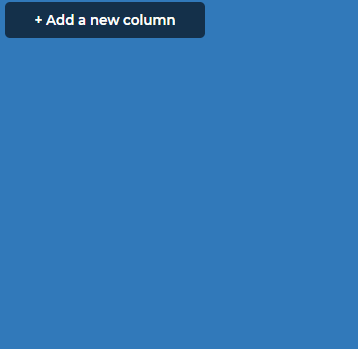
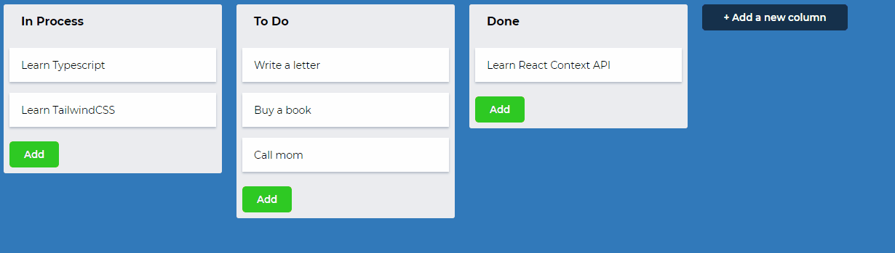
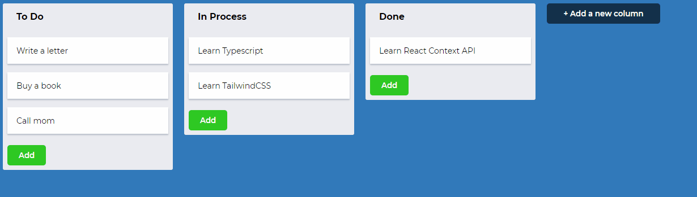

<h1>Trello clone con ReactJS</h1>
 
<h3>Funciones:</h3>
<ul>
    <li><h4>Agregar columnas y tareas con sus respectivos titulos.</h4></li>
    
    <li><h4>Arrastrar las columnas y cambiarlas de lugar.</h4></li>
    
    <li><h4>Arrastrar las tarjetas y posicionarlas en la columna deseada.</h4></li>
    
</ul>
 
<h3>Conceptos aplicados:</h3>
<ul>
    <li><h4>React Context</h4></li>
    <li><h4>React Reducers</h4></li>
    <li><h4>Styled Components</h4></li>
    <li><h4>React Drag and Drop library</h4></li>
</ul>
